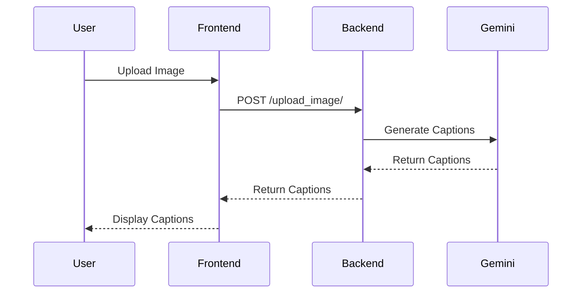
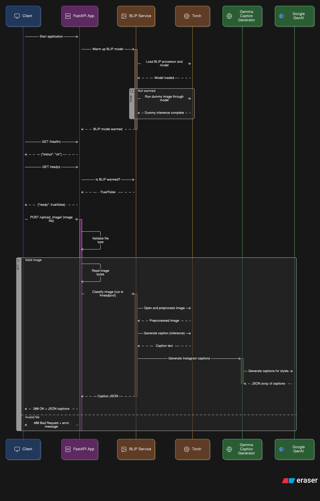

# Instagram AI Image Caption Generator (Backend)

Open-source, privacy-first Instagram caption generator using AI. FastAPI backend powered by BLIP (local image understanding) + Gemini/Gemma (creative text) to produce engaging, human-like, SEO-friendly Instagram captions.


## Unique Privacy Advantage (USP)

Your images are never sent to Google, OpenAI, or any third-party servers. The BLIP model runs locally to describe the image, and only that short text description is sent to Gemini/Gemma to generate captions. Ideal for privacy-conscious creators and teams.

> Note: This repository contains only the backend API. Pair it with any frontend (web/mobile) or use directly from your automation scripts.


## Table of Contents

- Features
- Demo Output
- Quick Start
- API Reference
- Sequence Diagram
- Deployment (Docker, AWS EC2, Azure VM)
- Configuration
- Performance Notes
- Roadmap
- Contributing
- License
- SEO Keywords & Topics


## Features

- AI-powered Instagram captions (BLIP + Gemini/Gemma)
- Multiple styles: Witty, Inspirational, Minimalist, Poetic, Intriguing Q&A, Evocative, Feeling-focused, Short & Punchy
- Privacy-first: image never leaves your server; only text description is sent
- FastAPI REST API with CORS enabled
- CPU-only friendly for free-tier cloud VMs (Docker-ready)
- Warm-up on startup + threadpool for responsiveness


## Demo Output

```json
[
  {
    "style": "Witty",
    "captions": [
      "Just a frame...waiting for its masterpiece. 😏 #artinprogress #blankcanvas #photography",
      "This frame is accepting applications for stories. ✍️ #storytime #creative #blackandwhite"
    ]
  },
  {
    "style": "Inspirational",
    "captions": [
      "The space to create. The space to grow. ✨ #inspiration #create #photography",
      "Embrace the blank page. Every moment is a chance to start anew. #newbeginnings"
    ]
  }
]
```


## Quick Start

### 1) Run locally (Python)

```bash
python -m venv .venv
. .venv/Scripts/activate  # Windows PowerShell: .venv\Scripts\Activate.ps1
pip install -r requirements.txt
$env:GOOGLE_API_KEY="your_api_key"  # Windows PowerShell
uvicorn main:app --host 0.0.0.0 --port 3000
```

Open: <http://localhost:3000>


### 2) Run with Docker

```bash
# Build
docker build -t instagram-ai-caption-backend .

# Run (port 8001)
docker run -p 8001:8001 --env GOOGLE_API_KEY=your_api_key instagram-ai-caption-backend
```

Or with Docker Compose:

```bash
docker compose up -d
```


## API Reference

Base URL depends on how you run the server. Defaults:

- Local Python: <http://localhost:3000>
- Docker/Compose: <http://localhost:8001>

### POST /upload_image/

- Form-data field: `file` (image)
- Response: JSON array of caption styles and two captions each

Example (PowerShell):

```powershell
Invoke-WebRequest -Uri http://localhost:8001/upload_image/ -Method POST -InFile .\sample.jpg -ContentType "multipart/form-data"
```

Example (curl):

```bash
curl -X POST http://localhost:8001/upload_image/ -F "file=@sample.jpg"
```

Health endpoints:

- GET `/healthz` → `{ "status": "ok" }`
- GET `/readyz` → `{ "ready": true }` once warm-up completes


## Sequence Diagram






## Deployment (Docker, AWS EC2, Azure VM)

- Build and push the Docker image, or use `docker compose` on the VM.
- Expose port 8001 (or your chosen port) in firewall/security group.
- Set the environment variable `GOOGLE_API_KEY`.
- Choose a CPU-only, free-tier-friendly VM (e.g., t3.micro on AWS, B1s on Azure).

AWS EC2 quick hints:

- Security Group: allow inbound TCP 8001 from your IP
- Use a lightweight base (Ubuntu/Debian) and install Docker
- `docker compose up -d` in the project directory

Azure VM quick hints:

- Open port 8001 in NSG
- Install Docker and Docker Compose
- `docker compose up -d`


## Configuration

- `GOOGLE_API_KEY` (required): API key for Gemini/Gemma via google-genai.
- BLIP model: `Salesforce/blip-image-captioning-base` (cached on first build).

Files included for deployment:

- `Dockerfile` (CPU-only PyTorch, pre-caches BLIP)
- `docker-compose.yml` (healthcheck + resource limits)


## Performance Notes

- Optimized for CPU-only: greedy decoding, short max tokens, `torch.inference_mode()`
- Warm-up on startup to reduce first-request latency
- Threadpool offloads heavy work to keep the event loop responsive
- Typical latency target on 1 vCPU free-tier VM after warm-up: ~10–15s (depends on network and LLM response size)


## Roadmap

- Optional quantized BLIP variant for even faster CPU inference
- Streaming responses and partial caption updates
- Frontend demo (React/Vue) with drag-and-drop upload
- Built-in rate limiting and auth options


## Contributing

Contributions are welcome. Please read the [CONTRIBUTING.md](CONTRIBUTING.md) for guidelines.

If this project helps you, consider opening issues, making PRs, and sharing feedback.


## License

AGPL 3.0 License


## SEO Keywords & Topics

Instagram caption generator, Instagram AI caption generator, image captioning, AI captions for Instagram, BLIP image captioning, Gemini captions, Gemma captions, FastAPI Instagram backend, Python Instagram tool, social media automation, privacy-first AI, on-device AI, CPU-only AI, open source Instagram captioner, Docker FastAPI backend, Hugging Face Transformers, content creator tools


